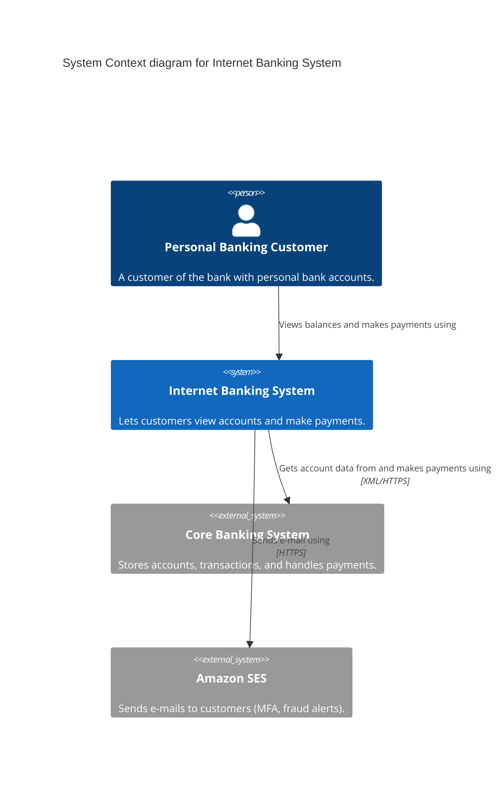
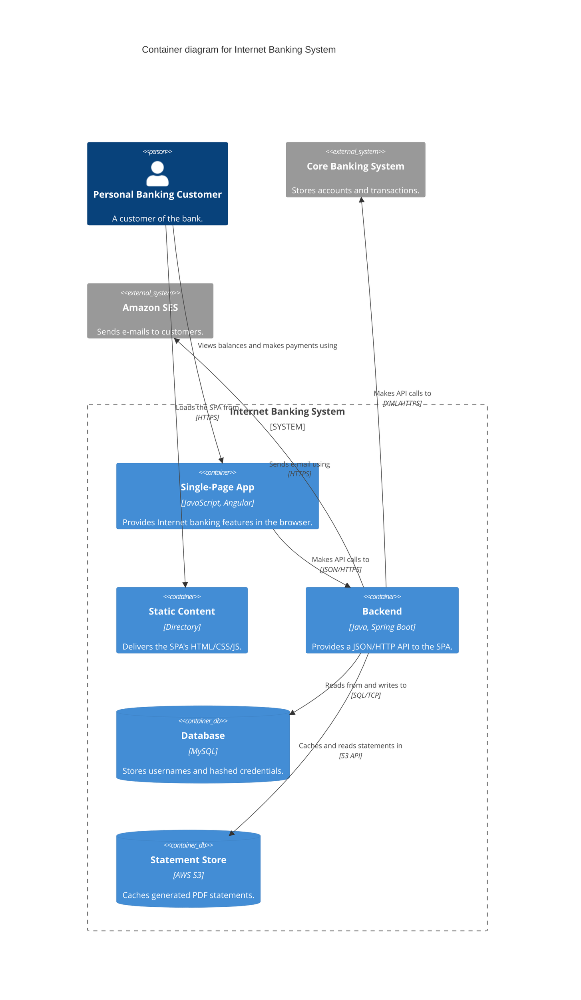

# C4 Model Diagrams (Mermaid)

The C4 model (by Simon Brown) brings structure to ad-hoc "boxes and arrows"
architecture diagrams. Its power is **a small set of shared abstractions** plus
**a hierarchy of diagrams** that let you zoom in and out like a map — telling
different stories to different audiences at different levels of detail.

Your job with this skill is to produce clear, faithful C4 diagrams in Mermaid,
and to get the *abstractions* right before worrying about how they render.

## The mental model, in one paragraph

A **software system** is made up of one or more **containers** (separately
deployable/runnable applications and data stores), each of which contains one or
more **components** (groupings of related code behind an interface), which are
implemented by **code** elements (classes, functions). **People** (roles/actors)
use software systems. Diagrams mirror this hierarchy: *system context →
container → component → code*, plus three supporting diagrams (*dynamic*,
*deployment*, *system landscape*).

## Step 1 — Get the abstractions right (this is the hard part)

Before drawing anything, classify each thing you'll show. Ambiguity here is the
root cause of bad diagrams. Use these definitions and heuristics:

| Abstraction | What it is | Heuristic |
|---|---|---|
| **Person** | A human user, modeled by their role/persona | "Who uses this, and to do what?" |
| **Software System** | The highest level of value delivery. Your system, *and* external systems it depends on. Treat externals as **opaque boxes you can't see inside**. | Usually one system = one team's ownership boundary / one thing deployed together. |
| **Container** | A separately deployable/runnable **application or data store** (web app, SPA, mobile app, API, serverless function, shell script; database schema, blob store, file system, **message queue/topic**). | "Is it a runtime process or a data store with isolation from others?" Communication between containers is out-of-process/network. |
| **Component** | A grouping of related code behind a well-defined interface, running **inside** a container. Not separately deployable. | "Containers contain components." All components in a container share one process. |
| **Code** | Classes, interfaces, functions inside a component. | Rarely diagrammed — the code already shows this. |

**Critical heuristics** that catch most modeling mistakes:

- **"Can these technologies run in the same OS process?"** If you find yourself
  labeling one container "Java and MySQL", it's wrong — Java needs a JVM, MySQL
  needs a database server. That's two containers, not one.
- **A microservice is usually *not* a single container.** If it's an API + its
  own database schema, that's *two containers* (optionally grouped with a
  boundary box). Model a microservice as a **group of containers** when it lives
  inside one team's system, or as a **software system** when a separate team
  owns it. See `references/advanced-patterns.md`.
- **Message queues/topics are data-store containers**, not a "message bus"
  software system. Model each queue/topic as a `ContainerQueue`. This reveals
  the real producer→consumer coupling. See `references/advanced-patterns.md`.
- **External vs. integral.** An external SaaS you merely call (e.g. an email
  API) is a *software system*. A cloud store whose contents/organization you own
  (e.g. an S3 bucket that's part of your system) is a *container*, even though a
  third party hosts it.
- Things that are **not** software systems: product domains, DDD bounded
  contexts, business capabilities, feature teams/squads. Those are *groupings*
  overlaid on the abstractions, not abstractions themselves.

## Step 2 — Choose which diagram(s) to draw

Don't reflexively produce all four levels. Match the diagram to the question
being asked and to how fast it will go stale.

- **System Context** — almost always start here. One box for your system,
  surrounded by the people and external systems it interacts with. Audience:
  everyone, technical and not. Ages slowly. **Recommended for all teams.**
  Include the *functional* users (people pursuing a business goal). Add
  admins/ops staff only when they use a part built for them (e.g. an admin UI) —
  or split them onto a separate version of the diagram. It's also a scoping tool:
  drawing it settles what's *inside* vs *outside* the system boundary.
- **Container** — zoom into your system to show apps + data stores, their
  responsibilities, key tech choices, and how they talk. Audience: technical
  (plus ops, QA, security review). Ages slowly. **Recommended for all teams.**
- **Component** — zoom into *one* container. Optional; ages fast; gets cluttered
  past a handful of components. Use for genuinely complex apps, or a single
  "slice" (one feature) rather than everything.
- **Code** — rarely worth it; the IDE/code already shows this. Only for the most
  important/complicated components.
- **Dynamic** — how a *specific feature* works at runtime (a subset of elements
  collaborating). Use sparingly, for interesting/recurring/complicated flows.
- **Deployment** — how instances map onto infrastructure, **one diagram per
  environment** (dev, staging, prod). Keep deployment details *off* the
  container diagram and *on* here. **Recommended, especially for production.**
- **System Landscape** — a context diagram without a single focus: a map of many
  systems across a group/department/org. Useful for larger orgs.

Default recommendation when unsure: **system context + container**. That's
enough for most teams. Add others only when they earn their keep.

## Step 3 — Render it in Mermaid

Mermaid has native C4 diagram types. Read `references/mermaid-c4-syntax.md` for
the full element/relationship/boundary/layout reference and worked examples of
all five diagram types. Two inline examples to anchor the shape:

**System Context** (Internet Banking System, from the book):

**Container** (zooming into that system):

> **Layout note:** Mermaid's native C4 auto-layout is finicky. Nudge it with
> directional relationships (`Rel_U/Rel_D/Rel_L/Rel_R`), `UpdateLayoutConfig`,
> and `UpdateRelStyle(..., $offsetX, $offsetY)`. If layout control matters more
> than semantic tags, a styled `flowchart` with subgraphs is a valid fallback —
> `references/mermaid-c4-syntax.md` covers when and how.

## What makes the diagram *good* (not just correct)

The single biggest lever is **add more words**. Most bad diagrams are just named
boxes. For every element, put inside it:

- **Name** — what it's called.
- **Type** — the abstraction, e.g. `[Software System]`, `[Container]`. Mermaid's
  C4 shapes add this automatically; in a `flowchart` fallback, write it yourself.
- **Technology** — for containers/components, the 1–2 most significant choices
  (e.g. "Java, Spring Boot"). Optional major version if upgrades are painful.
- **Description** — a short sentence (or ≤7 bullets) on its responsibility.

For every **relationship**:

- **Label every arrow** with intent, and make it read as a sentence. **End with
  a preposition** ("Makes API calls **to**", "Reads **from**") so the arrow
  direction is unambiguous.
- **Arrows are unidirectional.** Collapse a request/response pair into one arrow
  from the initiator to the receiver. Only draw two arrows when the two
  interactions genuinely differ (e.g. sync API request + async event).
- **Add technology** to inter-container arrows (the protocol: JSON/HTTPS, gRPC,
  SQL/TCP). Component-to-component in-process calls usually need no tech.
- **Pick an arrow meaning and stay consistent.** Request-driven systems read best
  with *dependency* arrows (initiator → receiver); message/event-driven systems
  read best with arrows showing the *flow* of messages/events. Don't mix the two
  meanings silently in one diagram.
- **Line style can carry a second signal:** solid for synchronous, dashed for
  asynchronous is a common convention. If you use it, put it in the key. Avoid
  relying on different *arrowheads* — the distinctions vanish when zoomed out.

Then:

- **Title every diagram** with its *type* and *scope*, e.g. "Container diagram
  for Internet Banking System". So it stands alone when pulled out of context.
- **Provide a key/legend** for any notation whose meaning isn't self-evident —
  every colour, shape, line style, and icon you use to *differentiate* things.
  If it's obvious from Mermaid's built-in C4 shapes, a note suffices.
- **Be consistent across the set.** Same element = same name, same notation, same
  placement (e.g. people at the top) on the context *and* container diagrams.
- **Keep deployment details off** context/container diagrams — they belong on a
  deployment diagram (they vary per environment).
- **Expand or gloss code names/acronyms.** "Plutus (payment service)" beats a
  wall of Greek names to a newcomer. (Common technical abbreviations — HTTP, JSON,
  SQL — are fine as-is for a technical audience.)
- **Keep elements roughly the same size.** Readers assume a bigger box means
  bigger/more-complex/more-important. Only vary size if you *mean* to say that.
- **Layout consistency across the set.** If people are at the top of the context
  diagram, keep them at the top of the container diagram. Same element → same
  name, notation, and placement everywhere it appears.

## Review checklist (use when critiquing any diagram)

Ask these; each "no" is something to fix. Condensed from the book's appendix.

**Diagram:** Has a title? Type clear? Scope clear? Has a key for the notation?

**Every element:** Has a name? Type/abstraction clear? Do you understand what it
*does*? Tech choices clear (where applicable)? Acronyms/code names explained?
Meaning of any colours/shapes/icons/border-styles/sizes explained?

**Every relationship:** Has a label describing intent? Does the label match the
arrow direction (read it as a sentence)? Tech/protocol clear where it's
inter-process? Meaning of any colours/line-styles/arrowheads explained?

If the diagram feels too complicated, consider that **the design** may be too
complicated — the diagram is a feedback loop, not just documentation.

## Diagrams are only half the story

- **Diagrams show the *what*, not the *why*.** They capture the outcome of
  decisions, not the reasoning. Pair them with lightweight supplementary docs — a
  template like [arc42](https://arc42.org) plus a set of Architecture Decision
  Records (ADRs) — to record *why* the architecture is the way it is. When you
  hand over a diagram, point to (or offer to draft) that companion text.
- **C4 is not a software-design process.** It describes a system at different
  levels of abstraction; it says nothing about who designs what or in what order.
  Don't turn the four levels into a workflow (BA does context, architect does
  containers, …) unless the user explicitly wants that.
- **C4 is not a silver bullet.** It's one tool in the box. Supplement with
  UML/ERD/BPMN/state-charts/context-maps where those fit better (see Scope notes),
  and don't force everything into C4.

## Advanced topics

For microservices, message-driven architectures, architectural layers /
groupings, strategies for scaling to large systems (splitting diagrams, "not
shown for brevity", per-feature slices, perspectives), and the
modeling-vs-diagramming mindset (plus where C4 + AI goes next), read
`references/advanced-patterns.md`.

## Scope notes

C4 fits custom-built enterprise software (monolith or distributed, any general
language, on-prem or cloud). It fits less well for embedded/firmware, heavily
customized platforms (SAP/Salesforce), and libraries/frameworks/SDKs — for those,
say so and suggest UML/ERD/BPMN as complements rather than forcing C4.
