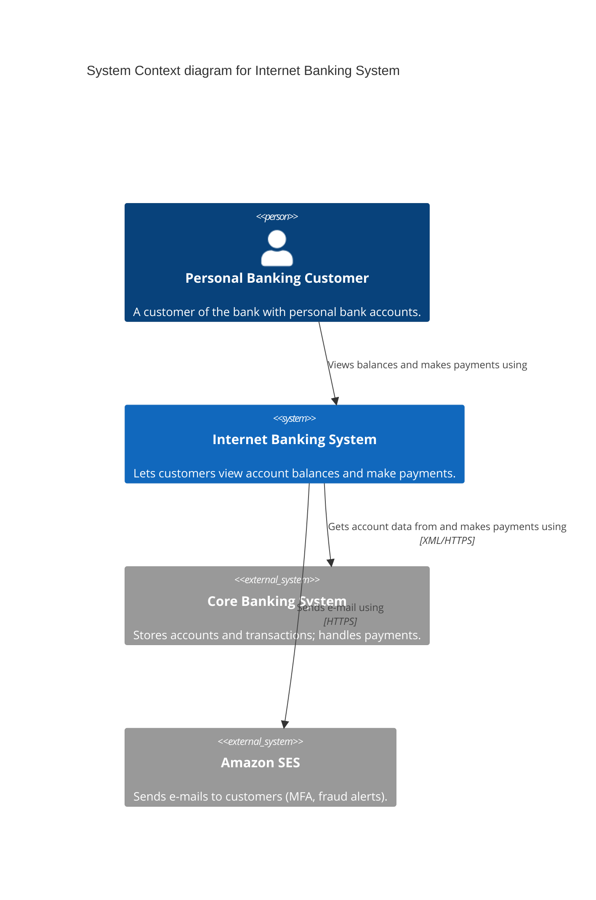
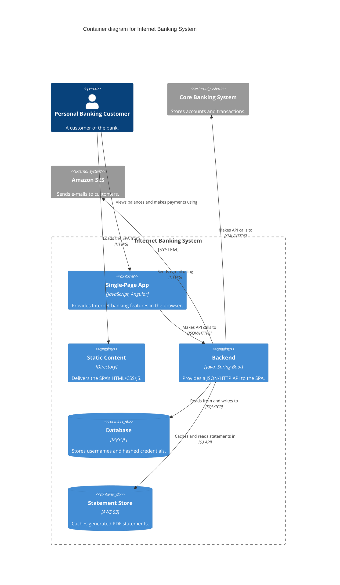
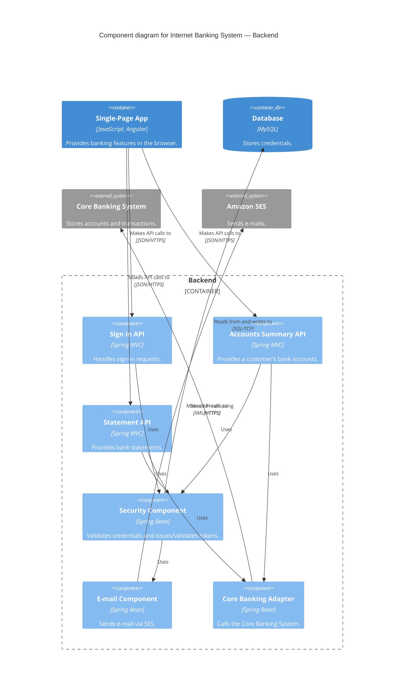
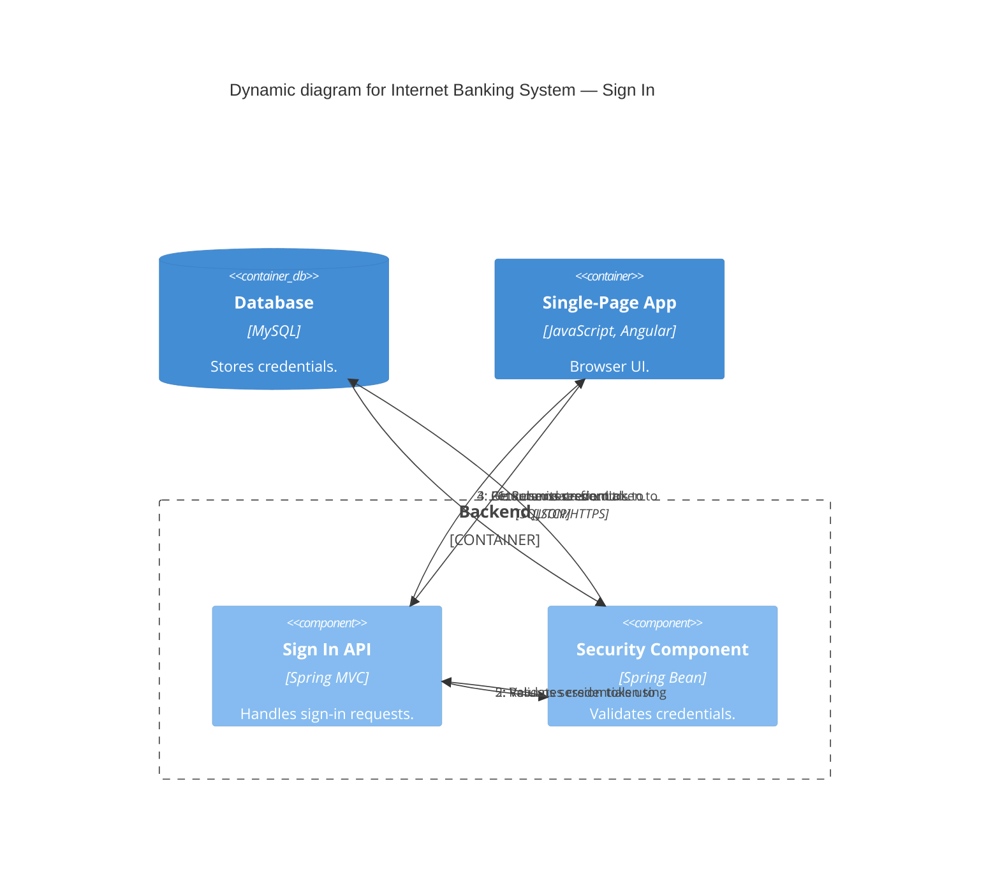
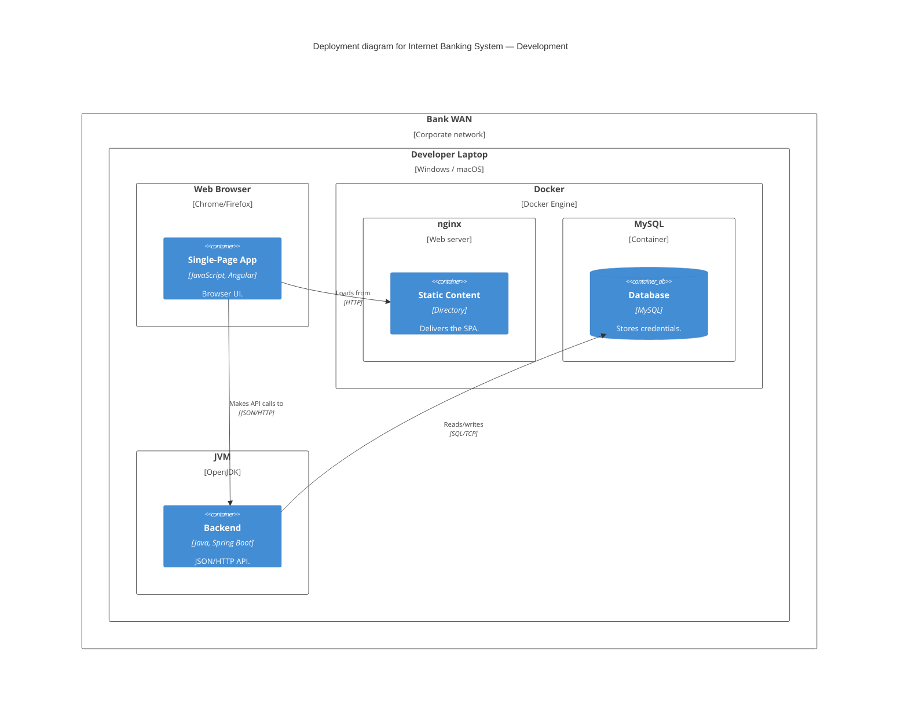
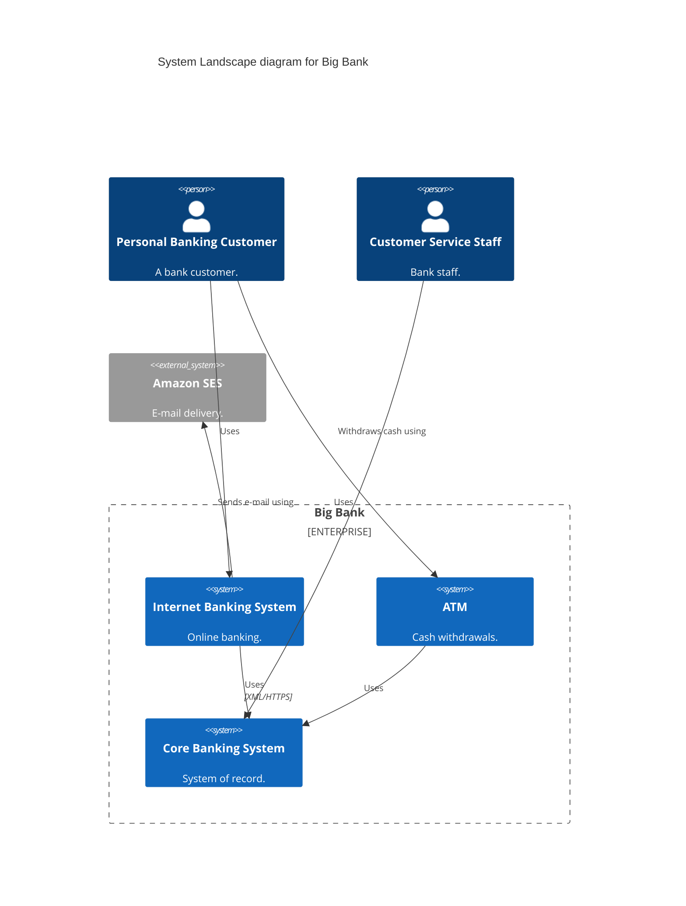
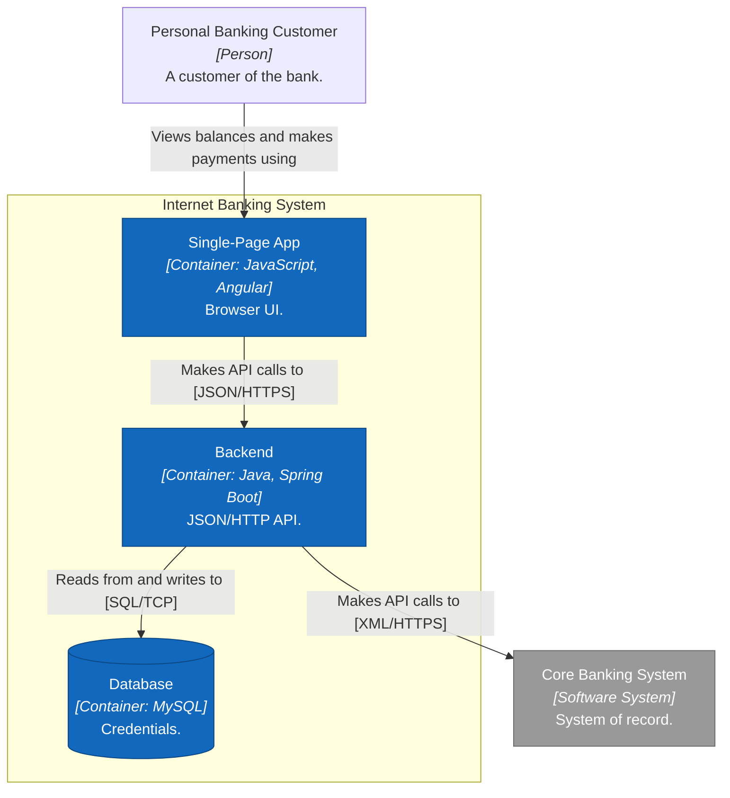

# Mermaid C4 syntax reference

Mermaid supports C4 natively via five diagram kinds:
`C4Context`, `C4Container`, `C4Component`, `C4Dynamic`, `C4Deployment`.
The syntax is shared; the diagram kind sets the intended level.

> Mermaid's C4 support is officially **experimental** and its auto-layout is the
> weakest part. Get the model right first, then spend effort on layout hints.
> If layout fights you, see "Flowchart fallback" at the end.

## Table of contents
1. Elements (people, systems, containers, components)
2. Boundaries
3. Relationships
4. Layout & styling control
5. Worked example: System Context
6. Worked example: Container
7. Worked example: Component
8. Worked example: Dynamic
9. Worked example: Deployment
10. System Landscape
11. Flowchart fallback (when native C4 layout won't cooperate)

---

## 1. Elements

Signature is `Kind(alias, "Label", "Technology", "Description")`. Technology is
only present on container/component kinds. Every argument after the label is
optional, but **you should almost always fill in description** (and technology
for containers/components) — that's what makes C4 diagrams good.

People:
```
Person(alias, "Label", "Description")
Person_Ext(alias, "Label", "Description")        %% external person
```

Software systems:
```
System(alias, "Label", "Description")
System_Ext(alias, "Label", "Description")         %% external / opaque dependency
SystemDb(alias, "Label", "Description")            %% system that is a datastore (cylinder)
SystemQueue(alias, "Label", "Description")         %% system that is a queue
SystemDb_Ext(alias, ...) / SystemQueue_Ext(alias, ...)
```

Containers (note the extra Technology arg):
```
Container(alias, "Label", "Technology", "Description")
ContainerDb(alias, "Label", "Technology", "Description")     %% data store (cylinder)
ContainerQueue(alias, "Label", "Technology", "Description")  %% queue/topic
Container_Ext / ContainerDb_Ext / ContainerQueue_Ext         %% external variants
```

Components (same shape as containers, one level down):
```
Component(alias, "Label", "Technology", "Description")
ComponentDb(alias, "Label", "Technology", "Description")
ComponentQueue(alias, "Label", "Technology", "Description")
Component_Ext / ComponentDb_Ext / ComponentQueue_Ext
```

Use the `Db` variants for data stores and the `Queue` variants for message
queues/topics — this is how you honour the rule that **queues are data-store
containers**, not a "message bus" system.

## 2. Boundaries

Boundaries draw the dashed box that gives the hierarchy its meaning.

```
Enterprise_Boundary(alias, "Label") { ... }     %% org boundary (landscape/context)
System_Boundary(alias, "Label") { ... }         %% the system you're zooming into
Container_Boundary(alias, "Label") { ... }       %% the container you're zooming into
Boundary(alias, "Label", "type") { ... }         %% generic (e.g. grouping, region)
```

- On a **container diagram**, wrap your containers in a `System_Boundary` named
  after your system. Keep external people/systems *outside* it.
- On a **component diagram**, wrap your components in a `Container_Boundary`.
- Use a generic `Boundary(... , "group")` to overlay non-C4 groupings:
  microservice boundaries, architectural layers, teams, cloud regions.

## 3. Relationships

```
Rel(from, to, "Label", "Technology")             %% Technology optional
BiRel(a, b, "Label", "Technology")               %% two-way (use sparingly)
```

Directional variants force the arrow (and influence layout):
```
Rel_U / Rel_Up      Rel_D / Rel_Down
Rel_L / Rel_Left    Rel_R / Rel_Right
```

Label rules (from the method): make it a sentence, end with a preposition
("Makes API calls **to**"), and keep arrows unidirectional from initiator to
receiver. Add the protocol as Technology for inter-container calls.

## 4. Layout & styling control

```
UpdateLayoutConfig($c4ShapeInRow="3", $c4BoundaryInRow="1")
```
Controls how many shapes/boundaries pack per row — the main lever for overall
shape. Lower `$c4ShapeInRow` to force taller, narrower diagrams.

```
UpdateElementStyle(alias, $bgColor="grey", $fontColor="white", $borderColor="black")
UpdateRelStyle(from, to, $textColor="blue", $lineColor="blue", $offsetX="10", $offsetY="-20")
```
`UpdateRelStyle` offsets are the fix when a relationship label lands in an
awkward spot. Use `$tags`/`UpdateElementStyle` to colour-code (existing vs new,
owned vs external, etc.) — and if you colour-code, **describe it in a key**.

Custom tags for legend-driven colouring:
```
AddElementTag("new", $bgColor="#3f8f29", $fontColor="white", $legendText="New in this release")
Container(x, "X", "Java", "…", $tags="new")
```

## 5. Worked example — System Context



## 6. Worked example — Container



## 7. Worked example — Component

Scope is a **single container** (here, the backend). Wrap components in a
`Container_Boundary`; show only the neighbours the container talks to.



## 8. Worked example — Dynamic

`C4Dynamic` auto-numbers relationships in the order you declare them, so the
sequence tells a story. Show only the subset of elements the feature touches.



## 9. Worked example — Deployment

`C4Deployment` uses nested `Deployment_Node`s to show infrastructure, with
**container instances placed inside them**. Draw **one diagram per environment**.
`Node(...)` is an alias for `Deployment_Node`; `$type` is a free-text label.



For production, add `Deployment_Node`s for the cloud region/services (e.g. AWS
Fargate, RDS, S3), use `Node_L`/`Node_R` to place siblings, and remember to
switch protocols to their secure variants (HTTP → HTTPS).

## 10. System Landscape

Mermaid has no dedicated landscape kind — use `C4Context` without a single
system in focus. Show many systems + people, and use `Enterprise_Boundary` (or
generic `Boundary`) to mark org/department boundaries.



## 11. Flowchart fallback (when native C4 layout won't cooperate)

Native C4 layout can't always be tamed, and some renderers don't support the C4
kinds. A styled `flowchart` gives you full layout control at the cost of writing
the type/legend yourself. Keep the *method* — put name/type/tech/description in
the node text, label every edge with a preposition, wrap the system in a
subgraph, and add a legend.



Use `flowchart TB/LR` to force top-down or left-right; use nested `subgraph` for
container/component boundaries; use `[( )]` cylinder nodes for data stores.
